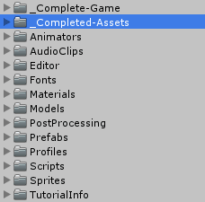
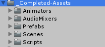
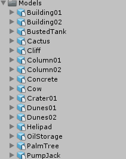
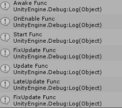
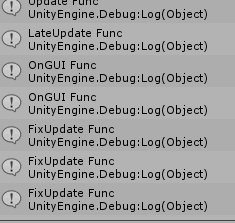
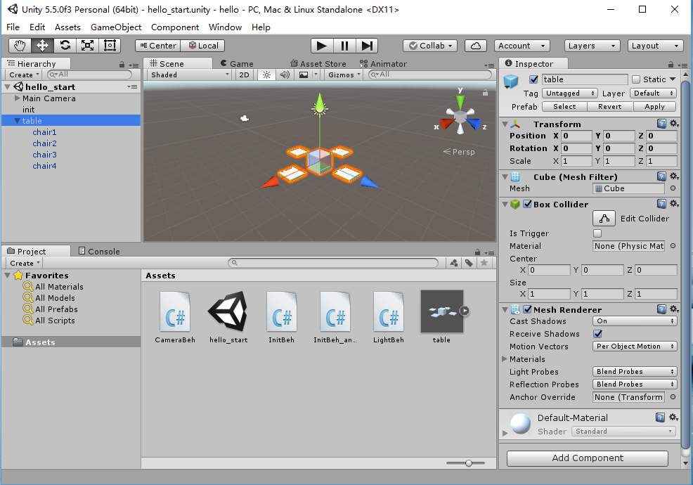
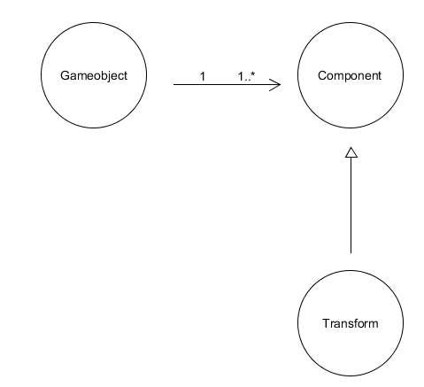

# Unity3D-HW1
## 解释 游戏对象（GameObjects） 和 资源（Assets）的区别与联系
**官方文档对于GameObject的解释：**  
GameObjects are the fundamental objects in Unity that represent characters, props and scenery. They do not accomplish much in themselves but they act as containers for Components, which implement the real functionality. 
 
**官方文档对于Assets的解释：**  
An asset is representation of any item that can be used in your game or project. An asset may come from a file created outside of Unity, such as a 3D model, an audio file, an image, or any of the other types of file that Unity supports. There are also some asset types that can be created within Unity, such as an Animator Controller, an Audio Mixer or a Render Texture. 
 
**二者的区分与联系:** 
游戏对象是各类资源的整合，如声音、脚本、图像、材料等等，作为资源的容器，对象可以具体可以体现为人物、道具、环境等。对象是游戏资源的具体表现，资源可以被多个对象利用，资源作为模版，可实例化游戏中具体的对象。 
## 下载几个游戏案例，分别总结资源、对象组织的结构（指资源的目录组织结构与游戏对象树的层次结构）
### Unity上的游戏学习例子：Tanks的总体架构

### Assets结构如下图所示

 
包括动画、音效、预置、场景、脚本

### 对象模版文件夹内容如下

 
包括建筑的元素以及游戏的参与对象等等

## 编写一个代码，使用 debug 语句来验证 MonoBehaviour 基本行为或事件触发的条件
### 函数测试代码部分

   <code>
     
     using System.Collections;
     using System.Collections.Generic;
     using UnityEngine;
     public class NewBehaviourScript : MonoBehaviour {
     
      // Use this for initialization
     
      void Start ()
      { 
          Debug.Log("Start Func");
      } 
     
      // Update is called once per frame
     
      void Update ()
      {
          Debug.Log("Update Func");
      }
     
      void Awake()
      {
          Debug.Log("Awake Func");
      }
     
      void FixedUpdate()
      {
          Debug.Log("FixUpdate Func");
      }
     
      void LateUpdate()
      {
          Debug.Log("LateUpdate Func");
      }
     
      void OnGUI()
      {
          Debug.Log("OnGUI Func");
      }
     
      void OnEnable()
      {
          Debug.Log("OnEnable Func");
      }
     
      void OnDisable()
      {
          Debug.Log("OnDisable Func");
      }
     
     }
   </code>

### 运行控制台效果图

 
Awake():当一个脚本实例被载入时Awake被调用。  
OnEnable():当对象变为可用或激活状态时此函数被调用。  
Start():Start仅在Update函数第一次被调用前调用。  
FixedUpate():当MonoBehaviour启用时，其 FixedUpdate 在每一帧被调用。  
UpDate():当MonoBehaviour启用时，其Update在每一帧被调用。 
LateUpdate():当Behaviour启用时，其LateUpdate在每一帧被调用。  
OnGUI():渲染和处理GUI事件时调用。  

## 查找脚本手册，了解 GameObject，Transform，Component 对象
### 官方描述
#### Gameobject
GameObjects are the fundamental objects in Unity that represent characters, props and scenery. They do not accomplish much in themselves but they act as containers for Components, which implement the real functionality. 
游戏对象是Unity中代表人物，道具和风景的基本对象。 它们本身并不完整，但它们充当组件的容器，它们实现了真正的功能。
#### Transform
The Transform component determines the Position, Rotation, and Scale of each object in the scene. Every GameObject has a Transform. 
变换组件确定场景中每个对象的位置，旋转和缩放比例。 每个GameObject都有一个变换组件。 
#### Components
Components are the nuts & bolts of objects and behaviors in a game. They are the functional pieces of every GameObject. 
组件是游戏中对象和行为的细节。 它们是每个GameObject的功能部分。
### 实例分析

#### Table对象的属性：

Tag（默认值为Untagged），Layer（默认值为Default）

#### Transform的属性：

Position（0，0，0）

Rotation（0，0，0）

Scale（1，1，1）

#### Table的部件：

Transform

MeshFilter

Box Collider

Mesh Render
### 用 UML 图描述 三者的关系（UMLet 14.1.1 stand-alone版本出图）

## 整理相关学习资料，编写简单代码验证以下技术的实现：
### 查找对象

   <code>
      
      GameObject.Find("Name");
      
      GameObject.FindGameObjectsWithTag("TagName");
      
      GameObject.FindWithTag("TagName");
      
      GameObject.FindObjectOfType("TypeName");
      
      GameObject.FindObjectsOfType("TypeName");
      
   </code>

      

### 添加子对象
``public static GameObect CreatePrimitive(PrimitiveTypetype)``
### 遍历对象树
``foreach (Transform child in transform) {  
         Debug.Log(child.gameObject.name);  
}``  
### 清除所有子对象

``foreach(Transform child in transform) {
   Destroy(child.gameObject);
}``

## 资源预设（Prefabs）与 对象克隆 (clone)
### 预设（Prefabs）有什么好处？
预设类似于一个模板，通过预设可以创建相同属性的对象，这些对象和预设关联，适于批量处理。 
### 预设与对象克隆 (clone or copy or Instantiate of Unity Object) 关系？
对象克隆也可以创建相同属性的对象，但是对象克隆与本体无关联。一旦预设发生改变，所有通过预设实例化的对象都会产生相应的变化，而对象克隆不受克隆本体的影响。
### 制作 table 预制，写一段代码将 table 预制资源实例化成游戏对象

   <code>
      
      using System.Collections;
      using System.Collections.Generic;
      using UnityEngine;
      public class NewBehaviourScript : MonoBehaviour {
      public GameObject Table;
      // Use this for initialization
      void Start () {
        GameObject instance = (GameObject)Instantiate(Table, new Vector3(0,0,1),transform.rotation);
        }  
      }
      
   </code>

## 尝试解释组合模式（Composite Pattern / 一种设计模式）使用 BroadcastMessage() 方法
组合模式是将对象组合成树形结构，以表示“部分整体”的层次结构，使用户对单个对象和组合对象的使用具有一致性。组合模式实现的关键——简单对象和复合对象必须实现相同的接口。 br/>
### 父类对象
 ``void Start () {  
         this.BroadcastMessage("TestChild");  
 }``  

### 子类对象
 ``void TestChild() {  
         print("Test!");  
 }``  
