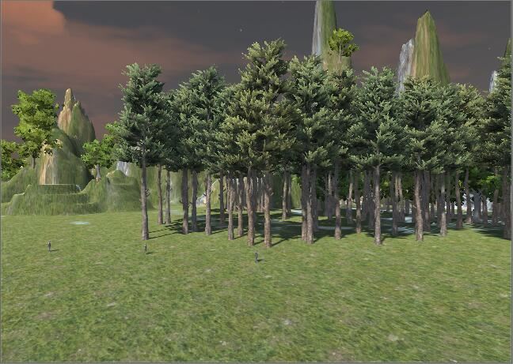

# 操作与总结
## 参考 Fantasy Skybox FREE 构建自己的游戏场景

游戏场景如上图，基本步骤就是添加天空盒、创建地形、形成山脉、刷草刷树，这样就可以创造出一个简单的游戏场景了。

## 总结游戏对象的使用

* 游戏基本对象
 - Empty
 - Camera
 - Light
 - 3D Object
 - Audio
 - Terrain

### Empty空对象
不显示游戏的对象，但是可以添加一些组件，比如场景控制、动作管理的脚本
### Camera摄像机
摄像机捕获的视野就是显示出的游戏世界，设计者可以通过增添摄像机、改变摄像机的位置和角度来渲染不同的游戏场景
### Light光线
光线的作用主要是来改变场景的颜色和氛围
### 3D 物体
由网格和不同的材质所表现出来的物体
### Audio声音
给游戏对象添加audio source组件，就可以使其发出声音
### Terrain地形
用于构造游戏场景，创造山脉、刷树刷草等等
