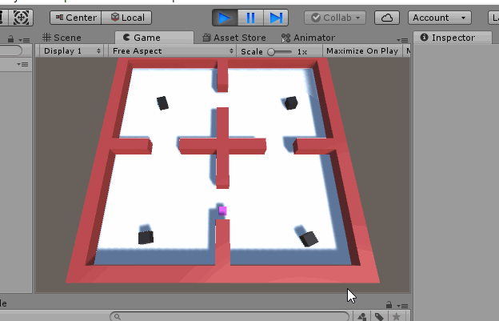

# 简单巡逻兵
---
## 游戏设计
* 创建一个地图和若干巡逻兵；
* 每个巡逻兵走一个3~5个边的凸多边型，位置数据是相对地址。即每次确定下一个目标位置，用自己当前位置为原点计算；
* 巡逻兵碰撞到障碍物，则会自动选下一个点为目标；
* 巡逻兵在设定范围内感知到玩家，会自动追击玩家；
* 失去玩家目标后，继续巡逻；
* 玩家每次甩掉一个巡逻兵计一分，与巡逻兵碰撞游戏结束；

## 游戏实现
### 资源预制
本次游戏实验主要有三个预制对象（如果不算墙的话）
* 玩家player
* 巡逻兵patrol
* 地图

玩家和巡逻兵可以根据自己的喜好引用一些网上的资源并且剪切合适的动画在对象处于不同状态的时候。 
地图的设置主要由不同形状的Qube拼合而成，可以根据自己的喜好给地图加一些Material，变得更加美观 
三个对象设计好添为预制，在场景控制脚本中对其实例化显示出来。

### 实现思路
#### 巡逻兵需要做什么？
巡逻兵有两种状态
* 巡逻
<<<<<<< HEAD
 * 玩家不在视野范围内
 * 巡逻兵按照既定的路线行走，可以是一个凸多边形。
* 追捕
 * 玩家在视野范围内
 * 巡逻兵在该状态触发后朝着玩家的方向前进进行抓捕

=======
 * 玩家不在视野范围内 
 * 巡逻兵按照既定的路线行走，可以是一个凸多边形。
* 追捕
 * 玩家在视野范围内 
 * 巡逻兵在该状态触发后朝着玩家的方向前进进行抓捕
 
>>>>>>> 136f532f0770cc6510b92194104d97480b1123ff
#### 如何触发巡逻兵的状态？
参考了以往师兄们的博客，基本有两种实现的方法
* 给玩家设置内外两个collider，内部collider用来检测被抓捕活动的碰撞，外部collider作为巡逻兵的触发器，前提是设定好一定的触发距离。
* 在每个巡逻区的出入口处设置触发器，触发对应巡逻兵的状态。

#### 什么是发布订阅模式？
简而言之，有两个特点
* 一个发布者对应多个订阅者
* 发布者发布消息后，订阅者即使接收并处理数据

发布订阅模式是最常用的一种观察者模式的实现，并且从解耦和重用角度来看，更优于典型的观察者模式。我们要确定好委托以及要发布的事件。在发布订阅模式中，发布者和订阅者之间多了一个发布通道；一方面从发布者接收事件，另一方面向订阅者发布事件；订阅者需要从事件通道订阅事件以此避免发布者和订阅者之间产生依赖关系。
 
在本次游戏实验中用到的例子：
* 触发器中玩家成功逃离发布事件，记分函数进行订阅并更新得分情况
* 玩家被抓捕后发布碰撞事件，游戏状态进行订阅并停止游戏

### 补充
* 很愧疚地来说由于时间关系只能用qube来代替玩家和巡逻者，并为设计动画，如果以后有时间再来补充
* 实现方法参考了以往师兄的一些博客，脚本代码已经上传
<<<<<<< HEAD
* 考虑到没有合适录屏软件以及视频网站审核时间，本次实验用gif展示
=======
* 考虑到没有合适录屏软件以及视频网站审核时间，本次实验用gif展示 
>>>>>>> 136f532f0770cc6510b92194104d97480b1123ff
* 游戏的很多部分还需进一步完善

## 游戏效果
### 巡逻

### 抓捕

